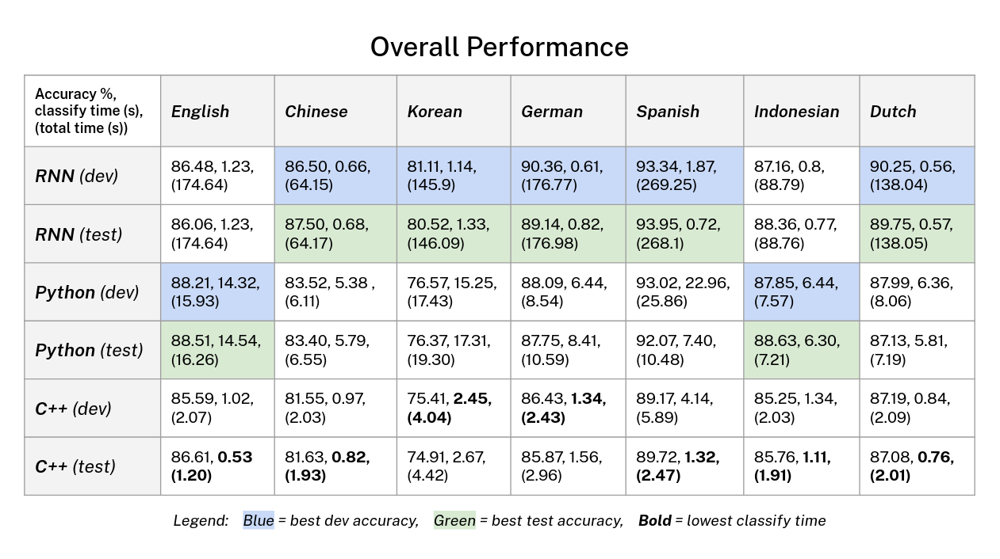

# LING 227 Final Project

POS Tagging.

## Authors

[Kevin Chen](https://github.com/inchkev), [Nick Schoelkopf](https://github.com/NickSchoelkopf), [Neal Ma](https://github.com/nmadev)

## Results

## Datasets used

- [English](https://github.com/UniversalDependencies/UD_English-EWT)
- [Chinese](https://github.com/UniversalDependencies/UD_Chinese-GSDSimp/tree/master)
- [Korean](https://github.com/UniversalDependencies/UD_Korean-Kaist/tree/master)
- [German](https://github.com/UniversalDependencies/UD_German-GSD/tree/master)
- [Spanish](https://github.com/UniversalDependencies/UD_Spanish-GSD/tree/master)
- [Indonesian](https://github.com/UniversalDependencies/UD_Indonesian-GSD/tree/master)
- [Dutch](https://github.com/UniversalDependencies/UD_Dutch-Alpino/tree/master)
