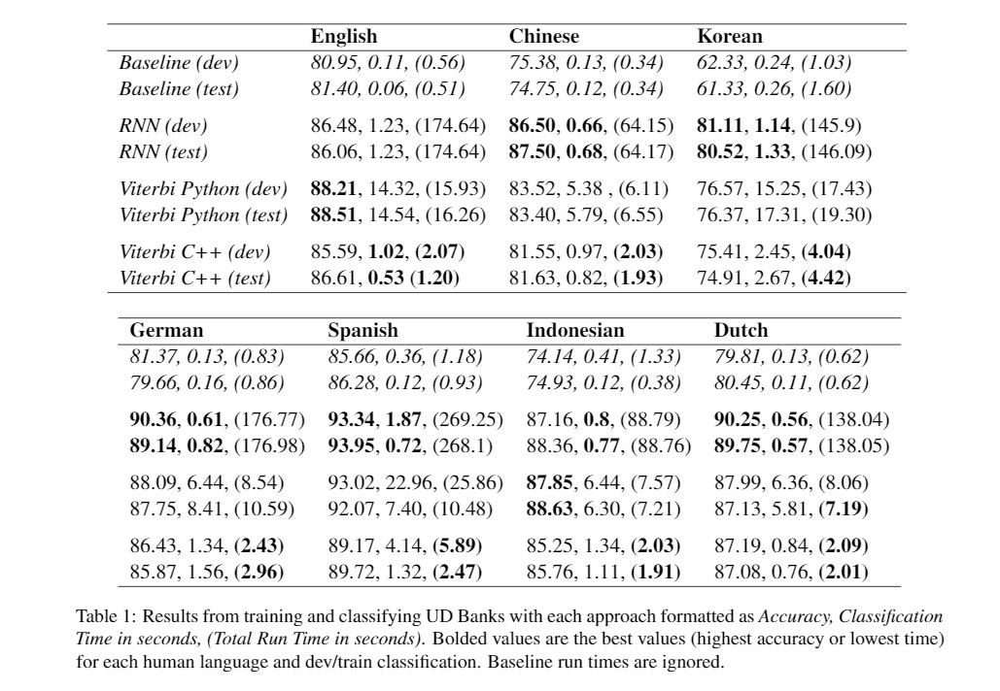

# Evaluating Algorithms and Languages for POS Tagging 

We implement the Viterbi algorithm in Python and C++, and a Recurrent Neural Network, to evaluate part of speech (POS) tagging.

Final project for LING 227.

## Running it yourself

### Python Viterbi

The Python Viterbi implementation is in the `viterbi_python` directory. To specify the dataset, set the `UD_BASE` variable
to the dataset's prefix (without "train.conllu", "dev.conllu", etc. as those are automatically appended). To run, use `python viterbi.py`.

### C++ Viterbi

The C++ Viterbi implementation is in the `viterbi_cc` directory. Specifics on terminal commands are found in `usage.txt`. The current executable, `Viterbi`, is compiled to run the Viterbi algorithm. To run the baseline approach, comment out line 90 in `viterbi.cc` and uncomment line 89, then run `make` in the terminal.

### Python RNN

The Python RNN (Bidirectional LSTM) implementation is in the `rnn` directory. To run, upload to Google Colaboratory and run with train, dev, and test sets for all languages in a folder in Google Drive titled `Colab Notebooks`, then run all cells in notebook in order. Exact accuracy numbers will vary slightly due to randomness in NN initialization.

## Results

## Datasets used

- [English](https://github.com/UniversalDependencies/UD_English-EWT)
- [Chinese](https://github.com/UniversalDependencies/UD_Chinese-GSDSimp/tree/master)
- [Korean](https://github.com/UniversalDependencies/UD_Korean-Kaist/tree/master)
- [German](https://github.com/UniversalDependencies/UD_German-GSD/tree/master)
- [Spanish](https://github.com/UniversalDependencies/UD_Spanish-GSD/tree/master)
- [Indonesian](https://github.com/UniversalDependencies/UD_Indonesian-GSD/tree/master)
- [Dutch](https://github.com/UniversalDependencies/UD_Dutch-Alpino/tree/master)

## Authors

[Kevin Chen](https://github.com/inchkev), [Nick Schoelkopf](https://github.com/NickSchoelkopf), [Neal Ma](https://github.com/nmadev)
